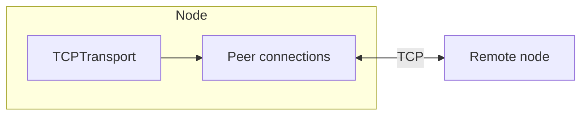

# StreamHive

StreamHive is a distributed, content-addressed file storage experiment in Go. The long-term goal is decentralized chunk storage and replication; the current codebase provides a tested TCP peer transport as the networking foundation.

**Status:** networking layer (listen, accept, dial, graceful close). Storage and content addressing are not implemented yet. Details: [docs/ARCHITECTURE.md](docs/ARCHITECTURE.md), [docs/WORKFLOWS.md](docs/WORKFLOWS.md).

## Prerequisites

- Go 1.22 or newer
- Optional: [golangci-lint](https://golangci-lint.run/) for local linting

## Quickstart

```bash
go test ./...
make run              # builds bin/fs and starts a listener on 127.0.0.1:0
./bin/fs -listen :7070 -dial 127.0.0.1:8080   # example: listen and dial another node
```

See the [Makefile](Makefile) for `test-race`, `vet`, `cover`, and `lint` targets.

## Architecture (current)



Planned: chunk store, Merkle-style addressing, and replication on top of this transport.
