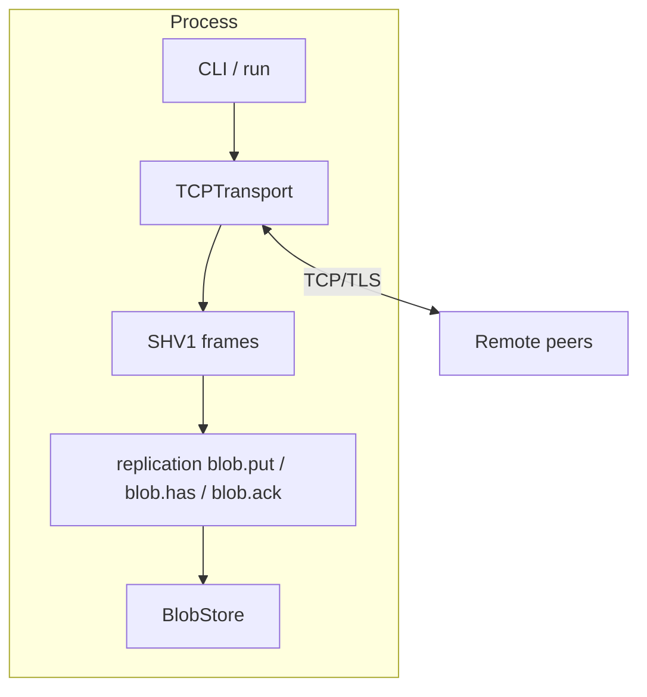

# StreamHive

[](https://github.com/AliSinaDevelo/StreamHive/actions/workflows/ci.yml)

StreamHive is a **Go library and CLI** for experimenting with distributed, content-addressed storage. It ships a production-minded **TCP transport** (context-aware listen/dial, TLS hooks, optional shared-token peer auth with application identities, framing, metrics, limits), a **length-prefixed wire format** (`SHV1`), a typed **blob replication protocol**, memory and file-backed **blob stores**, and operational endpoints (`/livez`, `/readyz`, `/peers`, `/metrics`, `/metrics/prometheus`, `/lifecycle/status`).

**Semver:** public API versions are tracked in [CHANGELOG.md](CHANGELOG.md) and [internal/version/version.go](internal/version/version.go) (currently **v0.13.0**, pre-1.0).

**Status:** networking, framing, local storage, content-addressed blob keys, static-peer replication, shared-token auth with optional peer identities and inbound allowlists, bounded ACK-driven retries for one-shot puts, startup and periodic anti-entropy sync, paged native inventory enumeration, ordered MemoryStore and FileStore cursor paths, aggregate-bounded per-peer inventory exchanges with cursor continuation, bounded repair responses with delayed continuation, durable stores, real-TCP restart-convergence acceptance coverage, self-repair demos, Prometheus metrics, CLI TLS/mTLS credential validity and expiry signals, bounded health HTTP resources, and an explicit resource-budget envelope with global repair I/O admission and staged P2P drain are implemented. The v0.13 lifecycle boundary now also has an internal capability-gated record applier, durable authority allocation, bounded journal/snapshot repair planning, durable per-peer watermarks, capability-gated repair frames, caller-owned repair sessions, negotiated startup-watermark reconciliation, opt-in CLI put/delete commands, raw-blob preflight, operator-authored membership fences, checkpoint-first compaction, and real-TCP plus three-node Compose convergence coverage; `-lifecycle` is disabled by default and requires authenticated peer identities while preserving raw compatibility. `storage.FileStore` provides durable local blobs for library users and CLI receivers via `-store-dir`; its process-local inventory index rebuilds from durable filenames when needed, without changing the file format. Older `BlobKeyLister` stores retain a compatibility fallback. Raw blob deletion remains local eviction, and lifecycle compaction never deletes raw blobs; the lifecycle contract is documented in [docs/LIFECYCLE_V0_13.md](docs/LIFECYCLE_V0_13.md). Conflict resolution, richer peer authorization policy, and global discovery are not implemented. See [docs/ARCHITECTURE.md](docs/ARCHITECTURE.md), [docs/RESOURCE_BUDGETS.md](docs/RESOURCE_BUDGETS.md), and [docs/PEER_DRAIN.md](docs/PEER_DRAIN.md).

## Prerequisites

- Go 1.22 or newer
- Optional: [golangci-lint](https://golangci-lint.run/) for `make lint`
- Optional: Docker for [docs/DEPLOYMENT.md](docs/DEPLOYMENT.md)

## Quickstart

```bash
go test ./...
go run . -version
make run
./bin/fs -listen :7070 -dial 127.0.0.1:8080
./bin/fs -listen 127.0.0.1:0 -health 127.0.0.1:8080   # HTTP live/ready/peers/metrics
```

### Two-node replication demo

Terminal 1: start a receiver with framed replication and metrics.

```bash
go run . -listen 127.0.0.1:7070 -replicate -health 127.0.0.1:8080
```

Terminal 2: dial the receiver and send one blob.

```bash
go run . -listen 127.0.0.1:0 -dial 127.0.0.1:7070 -put-content-key -put-data "hello streamhive" -exit-after-put
```

Inspect counters:

```bash
curl -s http://127.0.0.1:8080/metrics
```

Inspect connected peers:

```bash
curl -s http://127.0.0.1:8080/peers
```

Look for `replication_blobs_stored`, `replication_bytes_stored`, `replication_blob_acks_received`, `replication_blob_acks_matched`, `replication_blob_ack_timeouts`, `replication_blob_retries`, `replication_blob_puts_accepted`, `replication_blob_put_failures`, and `replication_blob_write_errors`, plus duplicate/skipped, anti-entropy (`replication_inventory_advertisements`, `replication_inventory_bytes_sent`, `replication_inventory_keys_sent`, `replication_inventory_keys_probed`, `replication_inventory_exchanges_started`, `replication_inventory_exchanges_completed`, `replication_inventory_exchanges_limited`, `replication_inventory_exchanges_active`, `replication_missing_keys_requested`, `replication_repair_blobs_sent`, `replication_repair_blobs_deferred`), auth, transport frame counters such as `peer_auth_identity_rejections`, and TLS identity health (`tls_certificates_configured`, `tls_certificate_expiry_timestamp_seconds`, `tls_certificates_expired`, `tls_certificates_not_yet_valid`, `tls_certificates_expiring_soon`). The sender derives the blob key from `SHA-256(put-data)` when `-put-content-key` is set; receivers verify SHA-256-shaped keys before storing. One-shot sends wait for a matching `blob.ack` and retry the idempotent `blob.put` within the configured budget. Structured delivery logs include the remote peer, key, outcome, and attempt count; anti-entropy repair deliveries are logged separately with `delivery=anti-entropy`. Use `/metrics` for JSON counters, `/metrics/prometheus` for sorted Prometheus text with `# HELP`/`# TYPE` metadata and no labels, and `/peers` for sorted peer metadata including remote address, local address, direction, connection timestamp, connection age, `auth_method` (`none` or `shared-token`), and optional `auth_identity`.

The optional health server bounds request headers to 1 MiB, reads and writes to 10 seconds, header
parsing to 5 seconds, and idle connections to 60 seconds. It shuts down gracefully when the
process context is canceled; see `make test-health-server` for the race-enabled proof.

The CLI owns one finite shutdown deadline through `-shutdown-grace` (3 seconds by default). On
application cancellation it stops scheduler and reconnect admission, shuts down health within
the remaining deadline, and then calls `TCPTransport.Drain(ctx)`. Fatal startup errors and a
successful `-exit-after-put` completion retain immediate cleanup; cancellation while waiting
for a blob acknowledgment uses the bounded drain path. See `make test-cli-shutdown` for the
race-enabled acceptance proof.

For bounded P2P shutdown, call `TCPTransport.Drain(ctx)` with a finite deadline. It quiesces
admissions, lets cooperative peer work finish, and force-closes remaining sockets at expiry;
`Close()` remains the immediate hard-stop path. The lifecycle is local and does not add a wire
shutdown message. Health metrics include `shutdown_state`, `shutdown_tracked_peers`,
`shutdown_tracked_goroutines`, `shutdown_forced_closes`, and `shutdown_deadline_expiries`.
Use `make test-peer-drain` for the real-TCP race-enabled acceptance target.

Continuation operations add the aggregate `replication_repair_continuations_scheduled`,
`replication_repair_continuations_completed`, and
`replication_repair_continuations_dropped` counters to both health formats.

Anti-entropy storage admission adds aggregate
`replication_repair_io_ops_started`, `replication_repair_io_ops_completed`,
`replication_repair_io_ops_waited`, `replication_repair_io_ops_rejected`,
`replication_repair_io_ops_in_flight`, and `replication_repair_io_ops_queued` metrics;
`-max-repair-ops` defaults to four concurrent blob operations.

Whole inventory exchanges are bounded independently per peer. The defaults are 16 MiB of
encoded inventory payload and 16,384 advertised keys per exchange; set either
`-max-inventory-bytes` or `-max-inventory-keys` to `0` to disable that cap. A saturated
exchange resumes from its exclusive key cursor after a short per-peer delay, while a
periodic sync remains the convergence fallback. Even a deliberately tiny byte budget
sends one minimum frame so progress cannot be permanently wedged.

For an explicit budgeted local run:

```bash
go run . -listen 127.0.0.1:7071 -replicate -peers 127.0.0.1:7070 \
  -max-inventory-bytes 16777216 -max-inventory-keys 16384
```

Or run the whole flow:

```bash
make demo-replication
```

For a 3-node Docker Compose demo with durable stores and node restart rehydration:

```bash
make demo-compose
```

For the authenticated lifecycle compaction and stale-peer snapshot proof:

```bash
STREAMHIVE_LIFECYCLE_TOKEN="replace-with-a-local-demo-token" make test-lifecycle-compose
```

The acceptance demo seeds a present record and tombstone, waits for both replicas, compacts and
restarts the source, then removes only node3's lifecycle metadata. Node3 reconnects with an empty
repair journal, receives the compacted checkpoint, and proves logical state plus the retained raw
SHA-256 blob. Compose cleanup runs on success, failure, or interruption.

For the authenticated Compose variant, set one shared token. The demo proves matching
tokens replicate, expected identities are authorized, unlisted identities and wrong tokens
are rejected before durable storage, and node3 repairs its exact key after a restart:

```bash
STREAMHIVE_PEER_TOKEN="replace-with-a-local-demo-token" make demo-auth
```

To inspect a running Compose cluster:

```bash
make demo-status
```

For a 3-node corruption repair demo that deletes node3's durable blob and waits for periodic anti-entropy to restore it:

```bash
make demo-repair
```

For a reconnect/failure demo that stops node2, deletes its durable blob while down, restarts it, and waits for peer reconnect plus repair:

```bash
make demo-failure
```

To force and observe a bounded repair continuation without periodic inventory:

```bash
make demo-continuation
```

This local two-node demo seeds three 4-byte blobs, caps one repair response at 8 bytes,
and verifies the delayed continuation delivers the remaining blob.

To prove that a bounded whole-inventory exchange converges across a real TCP disconnect and
durable target restart:

```bash
make demo-inventory-budget
```

This demo seeds eight SHA-256-addressed blobs, limits each inventory exchange to 128 encoded
bytes and one key, stops the target while the source cursor is active, restarts the target, and
checks all keys plus JSON and Prometheus inventory counters. It leaves periodic inventory off so
the result comes from startup exchange continuation and reconnect cleanup.

For repeatable multi-peer cursor and mutation coverage:

```bash
make test-inventory-fairness
```

This race-enabled acceptance target runs one source and two durable targets, mutates the source
between bounded pages, disconnects one target while the other continues, and verifies both final
key sets. Deletions are only exercised before advertisement because the current add/repair wire
protocol has no tombstone message.

To prove the live-cursor consistency boundary under a behind-cursor mutation:

```bash
make test-inventory-consistency
```

This race-enabled target inserts a new SHA-256 key behind an active bounded cursor, verifies that
startup-only work does not pretend to be a snapshot, and proves the configured periodic pass
repairs the key. See [docs/INVENTORY_CONSISTENCY.md](docs/INVENTORY_CONSISTENCY.md).

Deletion scope is explicit: `FileStore.Delete` is local eviction or garbage collection. A peer
may rehydrate that blob through the current add-only anti-entropy path; distributed logical
deletion is deferred to a separate versioned namespace design. See
[docs/DELETION_SEMANTICS.md](docs/DELETION_SEMANTICS.md).

To prove that local eviction is rehydrated by startup anti-entropy alone:

```bash
make test-eviction-repair
```

This race-enabled acceptance target first converges a durable target, evicts its local blob while
the process is stopped, restarts it with `-sync-interval 0s`, and verifies the exact SHA-256 bytes
return with zero active inventory work. It proves local object repair, not distributed logical
deletion.

To verify a configured peer admission cap over real TCP:

```bash
make test-peer-admission
```

This race-enabled target caps a server at one peer, opens two clients, and checks that one remains
active while the rejected connection increments `peers_rejected`. The default `-max-peers 0`
remains unlimited for compatibility; production nodes should set a finite value. See
[docs/PEER_ADMISSION.md](docs/PEER_ADMISSION.md).

For a longer-lived node with static peers, use `-peers` and reconnect backoff:

```bash
go run . -listen 127.0.0.1:7071 -peers 127.0.0.1:7070,127.0.0.1:7072 -peer-reconnect
```

`-peer-reconnect` retries only `-peers` targets. `-dial` stays a one-shot connection attempt for scripts and tests.

When both sides run with `-replicate`, peers advertise local keys on connect and send missing blobs to each other. A repair response that hits its byte budget gets one bounded delayed continuation; a large inventory exchange gets per-peer cursor continuations; duplicate requests are merged per peer and periodic inventory remains the fallback. This startup anti-entropy path works with memory storage and durable `-store-dir` receivers.

For long-running nodes, add periodic inventory sync:

```bash
go run . -listen 127.0.0.1:7071 -replicate -store-dir ./streamhive-data -peers 127.0.0.1:7070 -peer-reconnect -sync-interval 30s
```

For a private local cluster, require a shared peer auth token on every node:

```bash
go run . -listen 127.0.0.1:7070 -replicate -peer-auth-token "$STREAMHIVE_PEER_TOKEN" -peer-id node-a -peer-allow-ids node-b
go run . -listen 127.0.0.1:7071 -replicate -dial 127.0.0.1:7070 -peer-auth-token "$STREAMHIVE_PEER_TOKEN" -peer-id node-b -peer-allow-ids node-a
```

Peers that cannot complete the auth handshake are rejected before replication frames reach the application handler. `-peer-id` is an explicit application identity label exchanged during that handshake; `-peer-allow-ids` is an exact inbound authorization allowlist and rejects missing or unlisted identities. An empty allowlist preserves token-only compatibility. Use TLS or mTLS as well when the token or identity crosses a network you do not fully control.

For an operator-fenced lifecycle mutation, enable the private sidecar and use one explicit
command. A present mutation stores and verifies the SHA-256-addressed blob before its journal
record is published; a delete appends a tombstone and retains the raw blob:

```bash
go run . -listen 127.0.0.1:7071 -replicate -store-dir ./node-a-blobs \
  -lifecycle -lifecycle-dir ./node-a-lifecycle \
  -peer-auth-token "$STREAMHIVE_PEER_TOKEN" -peer-id node-a \
  -lifecycle-put-namespace demo -lifecycle-put-key item \
  -lifecycle-put-data "hello lifecycle" -lifecycle-exit-after-mutation

go run . -listen 127.0.0.1:7071 -replicate -store-dir ./node-a-blobs \
  -lifecycle -lifecycle-dir ./node-a-lifecycle \
  -peer-auth-token "$STREAMHIVE_PEER_TOKEN" -peer-id node-a \
  -lifecycle-delete-namespace demo -lifecycle-delete-key item \
  -lifecycle-exit-after-mutation
```

Add `-dial` or `-peers` to wait for each authenticated lifecycle replica to acknowledge the
mutation before exit. `-lifecycle-put-blob-key` may supply a hex SHA-256 key, but it must match
the put data. The durable `authority` sidecar advances `(epoch, sequence)` across restart;
failed writes may consume a token, never reuse one. Local mutation counters remain aggregate
and label-free.

Compaction is a separate operator command. Configure the durable membership fence with a
comma-separated identity list; each member must have acknowledged the requested journal tail
through the existing lifecycle repair path before compaction is accepted:

```bash
go run . -replicate -store-dir ./node-a-blobs \
  -lifecycle -lifecycle-dir ./node-a-lifecycle \
  -peer-auth-token "$STREAMHIVE_PEER_TOKEN" -peer-id node-a \
  -lifecycle-members node-b

go run . -replicate -store-dir ./node-a-blobs \
  -lifecycle -lifecycle-dir ./node-a-lifecycle \
  -peer-auth-token "$STREAMHIVE_PEER_TOKEN" -peer-id node-a \
  -lifecycle-compact
```

The membership file is checksummed and atomically replaced. Omitting `-lifecycle-members`
restores the previous operator-authored set; `-lifecycle-members=` explicitly persists an
empty set for a standalone node. A missing membership file, behind member, invalid watermark,
unsafe checkpoint, or corrupt checkpoint fails closed. `-lifecycle-compact` writes a complete
checkpoint, including tombstones, before replacing the journal tail and exits without opening a
TCP listener. It never deletes raw blobs. `/lifecycle/status` reports
`membership_configured`, `membership_members`, `membership_acknowledged`, the minimum acknowledged
watermark, the compaction target, `compaction_blocked`, and a bounded reason; the JSON and
Prometheus metrics expose the same aggregate state without member IDs or peer labels. The status
resource also reports aggregate repair session errors, received frames, and frame errors alongside
active, started, and completed sessions; these values contain no peer IDs, logical keys, blob keys,
or raw error strings. The focused stale-peer snapshot proof is repeatable with
`make test-lifecycle-compaction`.

When both authenticated peers advertise `lifecycle.repair-reconcile.v1`, each repair session first
reports its durable startup watermark. A source accepts a lower or zero report only through that
negotiated capability, then runs raw-blob preflight against the reconciled watermark before
planning a journal batch or checkpoint snapshot. Peers that advertise only `lifecycle.v1` retain
the monotonic acknowledgement path and raw compatibility.

For the verified TLS plus application-auth boundary, including wrong-CA and wrong-hostname
acceptance paths, see [docs/TLS_AUTH.md](docs/TLS_AUTH.md) and run `make test-tls-auth`.

To persist replicated blobs on the receiver, add `-store-dir`:

```bash
go run . -listen 127.0.0.1:7070 -replicate -store-dir ./streamhive-data
```

### Library packages

| Import | Purpose |
|--------|---------|
| `github.com/AliSinaDevelo/StreamHive/p2p` | `TCPTransport`, framing (`ReadFrame` / `WriteFrame`), optional peer auth, identities, inbound allowlists, peer snapshots, metrics |
| `github.com/AliSinaDevelo/StreamHive/replication` | Blob replication messages (`blob.put`, `blob.has`, `blob.get`, `blob.missing`, `blob.ack`) and store apply helper |
| `github.com/AliSinaDevelo/StreamHive/storage` | `BlobStore`, `BlobKeyLister`, `MemoryStore`, `FileStore`, SHA-256 content key helpers |

Wire handshake string constant: `p2p.HandshakeVersionV1` (carry inside application frames).

## CLI flags (stable surface)

| Flag | Meaning |
|------|---------|
| `-listen` | TCP listen address |
| `-dial` | Optional peer to dial after listen |
| `-peers` | Optional comma-separated peers to dial after listen |
| `-peer-reconnect` | Retry `-peers` with exponential backoff |
| `-peer-reconnect-min` / `-peer-reconnect-max` | Reconnect backoff bounds |
| `-sync-interval` | Periodically advertise local blob keys to connected peers (0 = startup only) |
| `-health` | HTTP `host:port` for `/livez`, `/readyz`, `/peers`, `/metrics`, `/lifecycle/status` |
| `-max-peers` | Cap simultaneous peers (0 = unlimited) |
| `-peer-auth-token` / `-peer-auth-timeout` | Optional shared-token peer auth before peer registration |
| `-peer-id` | Optional application identity exchanged during shared-token auth (requires `-peer-auth-token`) |
| `-peer-allow-ids` | Comma-separated exact inbound identities allowed during shared-token auth (requires `-peer-auth-token`) |
| `-dial-timeout` | Outbound dial timeout |
| `-read-idle-timeout` | Peer read deadline refresh |
| `-tls-cert` / `-tls-key` | Server TLS certificate and private key |
| `-tls-ca` / `-tls-server-name` | Client CA trust and verified server name |
| `-tls-client-cert` / `-tls-client-key` | Outbound mTLS client certificate and private key |
| `-tls-client-ca` / `-tls-require-client-cert` | Strict inbound mTLS client verification |
| `-tls-expiry-warning` | Aggregate warning window for configured TLS identities (`720h` default, `0` disables warning status) |
| `-tls-insecure-skip-verify` | Development-only client TLS bypass |
| `-replicate` | Enable blob replication from framed peers |
| `-store-dir` | Persist replicated blobs with `storage.FileStore` |
| `-lifecycle` | Opt in to the v0.13 lifecycle journal and repair sessions (requires `-replicate`, `-peer-auth-token`, and `-peer-id`) |
| `-lifecycle-dir` | Private directory for lifecycle journal, checkpoint, membership, and peer watermarks |
| `-lifecycle-max-records` / `-lifecycle-max-key-bytes` | Bound records and logical-key bytes per lifecycle repair frame |
| `-lifecycle-max-metadata-bytes` / `-lifecycle-max-frame-bytes` | Bound lifecycle metadata and encoded repair frame bytes |
| `-lifecycle-members` | Operator-authored comma-separated replica identities required for compaction; an explicit empty value creates an empty fence |
| `-lifecycle-compact` | Write a verified checkpoint through the durable tail and exit without opening the listener |
| `-lifecycle-put-namespace` / `-lifecycle-put-key` / `-lifecycle-put-data` | One local lifecycle present mutation (requires `-lifecycle`) |
| `-lifecycle-put-blob-key` | Optional hex SHA-256 key validated against `-lifecycle-put-data` |
| `-lifecycle-delete-namespace` / `-lifecycle-delete-key` | One local lifecycle tombstone (mutually exclusive with put) |
| `-lifecycle-exit-after-mutation` / `-lifecycle-mutation-timeout` | Wait for outbound lifecycle acknowledgements, then exit with a bounded deadline |
| `-list-keys` | Print durable `-store-dir` keys as hex and exit |
| `-put-key` / `-put-data` | Send one manually keyed blob to outbound peers |
| `-put-content-key` | Derive the outbound blob key from `SHA-256(-put-data)` |
| `-put-ack-timeout` | Time to wait for each one-shot blob acknowledgment |
| `-put-retries` | Additional one-shot blob sends after an ACK timeout (0-10) |
| `-put-retry-delay` | Initial delay before retrying an unacknowledged blob (backoff capped at 500ms) |
| `-exit-after-put` | Wait for matching acknowledgments from all outbound peers, then exit |
| `-max-blob-bytes` | Cap replicated blob payload size |
| `-max-repair-bytes` | Cap aggregate anti-entropy blob data per `blob.missing` response (0 = default) |
| `-max-repair-ops` | Cap concurrent anti-entropy blob reads/writes across peers (0 = default) |
| `-max-inventory-bytes` | Cap encoded `blob.has` bytes per peer exchange (0 = unlimited) |
| `-max-inventory-keys` | Cap advertised keys per peer exchange (0 = unlimited) |

See the [Makefile](Makefile) for `test-race`, `test-fuzz`, `test-budgets`, `test-lifecycle-compaction`, `test-lifecycle-compose`, `test-tls-auth`, `test-tls-credential-health`, `test-prometheus-format`, `test-health-server`, `vet`, `cover`, `lint`, and demos.

## Architecture (summary)


```mermaid
flowchart TB
  subgraph app [Process]
    CLI[CLI / run]
    T[TCPTransport]
    F[SHV1 frames]
    S[BlobStore]
    R[replication blob.put / blob.has / blob.ack]
    CLI --> T
    T --> F
    F --> R
    R --> S
  end
  T <-->|TCP/TLS| remote[Remote peers]
```

## Operations & supply chain

- CI pins third-party GitHub Actions to immutable commit SHAs and uploads **coverage** plus a **CycloneDX SBOM** (`sbom` job).
- [docs/WORKFLOWS.md](docs/WORKFLOWS.md) — local and CI expectations.
- [docs/GOVERNANCE.md](docs/GOVERNANCE.md) — branch protection and release hygiene.
- [docs/DEPLOYMENT.md](docs/DEPLOYMENT.md) — Docker and Kubernetes sketch.
- [docs/RESOURCE_BUDGETS.md](docs/RESOURCE_BUDGETS.md) — current admission, frame, blob, repair, and inventory budgets plus follow-ups.
- [docs/INVENTORY_ITERATORS.md](docs/INVENTORY_ITERATORS.md) — ordered inventory decision, measurements, and rejected alternatives.
- [docs/PROTOCOL.md](docs/PROTOCOL.md) — frame format, replication messages, limits, and repair behavior.
- [docs/RELEASE.md](docs/RELEASE.md) — release checklist.

## Contributing

See [CONTRIBUTING.md](CONTRIBUTING.md). Security: [SECURITY.md](SECURITY.md).

## License

MIT — see [LICENSE](LICENSE).
