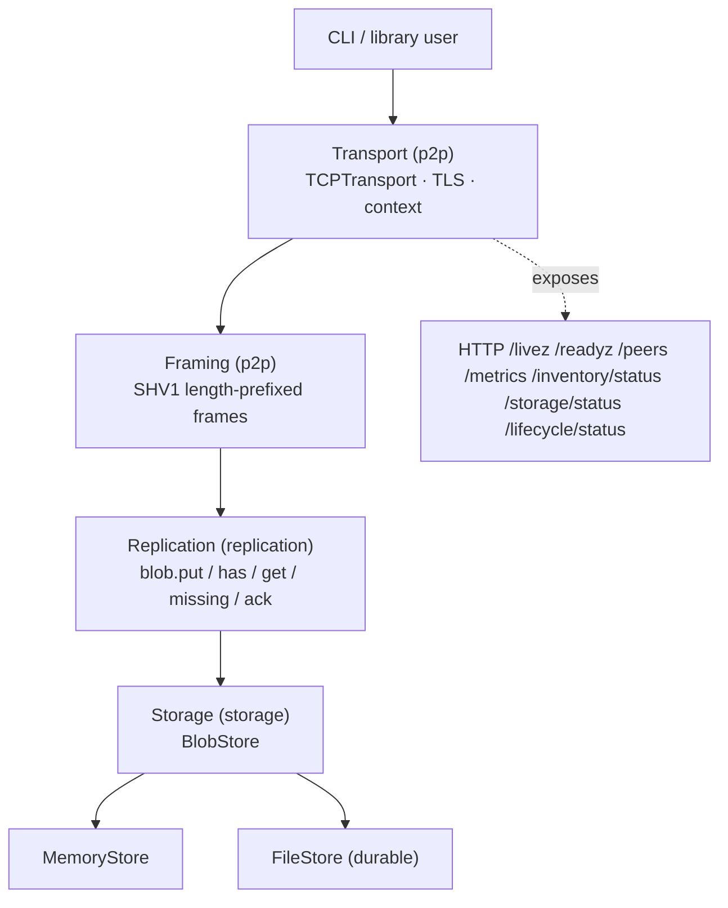
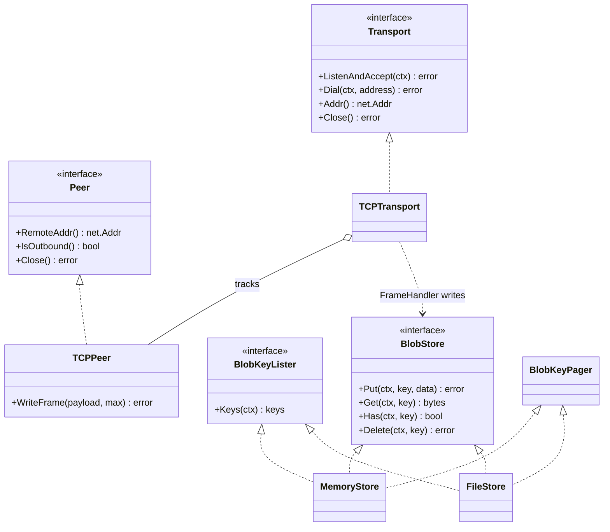
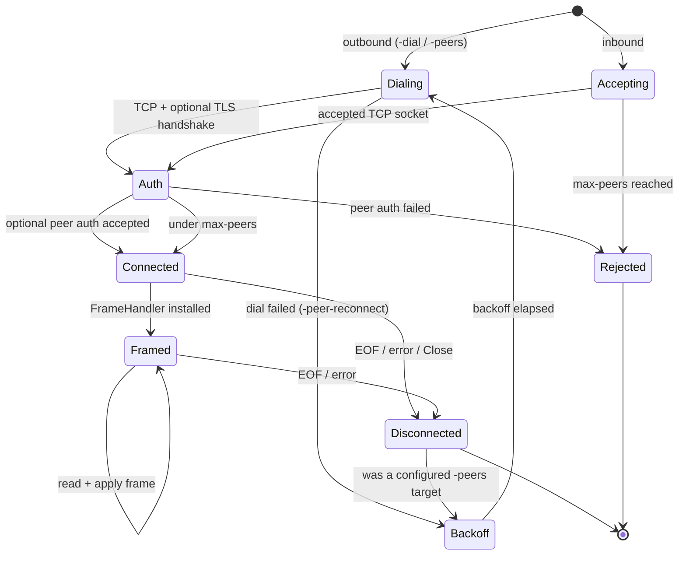
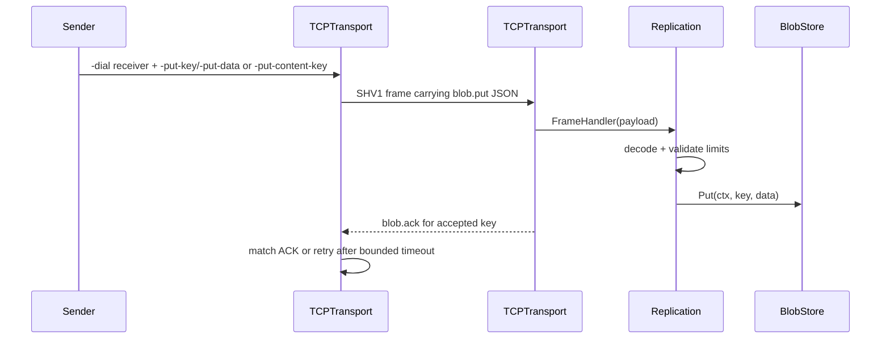

# Architecture

StreamHive is built in four layers — transport, framing, replication, and storage — each
a thin seam over the one below it. The diagram below is the fastest orientation; the
sections after it go deep.

```mermaid
flowchart TD
  cli["CLI / library user"] --> tr["Transport (p2p)<br/>TCPTransport · TLS · context"]
  tr --> fr["Framing (p2p)<br/>SHV1 length-prefixed frames"]
  fr --> rep["Replication (replication)<br/>blob.put / has / get / missing / ack"]
  rep --> st["Storage (storage)<br/>BlobStore"]
  st --> mem["MemoryStore"]
  st --> file["FileStore (durable)"]
  tr -. exposes .-> health["HTTP /livez /readyz /peers /metrics /inventory/status /storage/status /lifecycle/status"]
```

## Layers

1. **Transport (`p2p`)** — `TCPTransport` with `context.Context` on `ListenAndAccept` / `Dial`, accept-loop shutdown coordinated with `Close`, optional TLS, optional shared-token peer auth with exchanged application identities and exact inbound allowlists, optional framed reads via `FrameHandler`, metrics, peer snapshots with auth-method and identity labels, and peer disconnect hooks.
2. **Framing (`p2p`)** — `SHV1` length-prefixed payloads (`ReadFrame` / `WriteFrame`) with a configurable maximum size (DoS bound). Application-level handshake string: `HandshakeVersionV1`.
3. **Replication (`replication`)** — typed JSON messages carried inside frames. `blob.put` writes one key/value blob to a receiving `BlobStore`; `blob.has`, `blob.get`, and `blob.missing` provide the inventory/request vocabulary for anti-entropy sync; `blob.ack` records accepted puts.
4. **Storage (`storage`)** — `BlobStore` with `BlobKeyLister` and bounded `BlobKeyPager` inventory support, `MemoryStore` for tests/demos, and `FileStore` for durable local blobs; SHA-256 helpers provide stable content-addressed keys. Both stores page through ordered B-tree indexes. `InspectInventory` provides a live verified/opaque/corrupt/missing aggregate for the operator health surface. FileStore rebuilds its process-local index from durable filenames when first enumerated or when the directory modification stamp changes; no sidecar manifest is required.

## Package map

| Path | Role |
|------|------|
| `p2p` | `Peer`, `Transport`, `TCPTransport`, `TCPPeer`, wire framing |
| `replication` | Blob replication protocol, validation limits, apply helper |
| `storage` | `BlobStore`, `MemoryStore` |
| `internal/version` | Semver string for releases |
| `.` | CLI: `run`, health HTTP server, replication demo flags |

For the wire-level frame and message contract, see [PROTOCOL.md](PROTOCOL.md).

### Core interfaces

The seams are interfaces, so storage and peers are swappable without touching the layers
above. `TCPPeer` adds `WriteFrame` on top of the `Peer` contract.

```mermaid
classDiagram
  class Transport {
    <<interface>>
    +ListenAndAccept(ctx) error
    +Dial(ctx, address) error
    +Addr() net.Addr
    +Close() error
  }
  class Peer {
    <<interface>>
    +RemoteAddr() net.Addr
    +IsOutbound() bool
    +Close() error
  }
  class BlobStore {
    <<interface>>
    +Put(ctx, key, data) error
    +Get(ctx, key) bytes
    +Has(ctx, key) bool
    +Delete(ctx, key) error
  }
  class BlobKeyLister {
    <<interface>>
    +Keys(ctx) keys
  }
  class TCPPeer {
    +WriteFrame(payload, max) error
  }
  Transport <|.. TCPTransport
  Peer <|.. TCPPeer
  BlobStore <|.. MemoryStore
  BlobStore <|.. FileStore
  BlobKeyLister <|.. MemoryStore
  BlobKeyLister <|.. FileStore
  BlobKeyPager <|.. MemoryStore
  BlobKeyPager <|.. FileStore
  TCPTransport o-- TCPPeer : tracks
  TCPTransport ..> BlobStore : FrameHandler writes
```

## Concurrency and lifecycle

- Listener and peer map share a mutex; the accept loop exits when the listener is closed. `Close` is an immediate hard stop that closes tracked sockets without waiting for every per-peer goroutine. `Drain(ctx)` provides the bounded staged lifecycle described in [PEER_DRAIN.md](PEER_DRAIN.md).
- `Close` and `Drain` stop future admissions before teardown. `Drain` closes pending handshakes, gives active peer work until its finite deadline, then force-closes remaining sockets and joins tracked work for a bounded grace period. Peer goroutines remove themselves from the map on EOF / error via `unregisterPeer`.
- Optional `FrameHandler` runs per frame on each peer session until error, context cancellation, or disconnect. `TCPPeer.WriteFrame` serializes concurrent frame writers so ACK responses, retries, and inventory messages cannot interleave on one TCP stream.
- CLI replication installs a `FrameHandler` that decodes `blob.put` messages and writes to `MemoryStore` by default, or `FileStore` when `-store-dir` is set. Outbound `-put-key` / `-put-data` sends one manually keyed frame after `-dial` or `-peers` connects; `-put-content-key` derives the key from `SHA-256(-put-data)`. `-list-keys` inspects durable stores by printing known keys as hex.
- Receivers treat 32-byte keys as SHA-256 content addresses and verify payload integrity before storage. Exact duplicate key/data writes are skipped and counted separately; opaque keys with different data still replace existing values.
- `/storage/status` re-reads the configured inventory through `InspectInventory`, verifies content-addressed bytes, and reports aggregate health without changing readiness, deletion, repair, or wire semantics. The scan is live and uses bounded pages for native stores.
- `-peer-reconnect` manages only static `-peers` targets. It retries failed dials with exponential backoff and schedules another retry when an outbound configured peer disconnects. Once the application context is canceled, new reconnect scheduling is rejected and existing loops observe cancellation before dialing.
- CLI shutdown uses one `-shutdown-grace` deadline for the optional health server and concrete `TCPTransport.Drain(ctx)`. Application cancellation stops scheduler admission first; health shutdown consumes its portion of the deadline, then P2P drain quiesces admissions and joins or force-closes tracked work. The SHV1 wire contract is unchanged.
- Logical lifecycle state is intentionally separate from raw blob replication. The v0.13 research direction is an operator-fenced single authority per logical namespace with durable `(epoch, sequence)` records, per-peer journal watermarks, bounded lifecycle batches, and snapshot bootstrap when a peer falls behind compaction. Raw `BlobStore.Delete` remains local eviction in v0.12; a raw blob arriving from an older peer never creates a logical record. The complete lifecycle contract, mixed-version refusal, retention/compaction rules, and future implementation split are in [LIFECYCLE_V0_13.md](LIFECYCLE_V0_13.md).
- `-peer-auth-token` requires a shared-token auth frame before a peer is registered or allowed to exchange replication frames. The optional `-peer-id` is exchanged in that frame and retained as `auth_identity` on the remote peer. `-peer-allow-ids` applies an exact inbound identity allowlist; missing or unlisted identities are rejected. The default is unauthenticated for local demos. Connection logs and peer snapshots label the admission mode as `auth_method=none` or `auth_method=shared-token` and include the optional identity.
- Replication peers advertise local keys on connect. When `-sync-interval` is set, nodes also advertise local keys periodically to repair blobs added after peer startup. Native `BlobKeyPager` stores enumerate bounded pages with an exclusive bytewise cursor, then inventory advertisements are split into bounded `blob.has` frames at both the configured key limit and the transport payload limit. MemoryStore and FileStore use ordered B-tree indexes; FileStore rebuilds from hex filenames when its directory stamp changes, including mutations made through another store handle. Older `BlobKeyLister` implementations remain compatible through a complete-list fallback. Startup and periodic inventory run through a per-peer scheduler with one exclusive cursor, aggregate `-max-inventory-bytes` and `-max-inventory-keys` budgets, and delayed continuation after a budget hit; `0` disables the corresponding aggregate cap. A deliberately tiny byte cap still sends one minimum frame to guarantee progress. Receivers probe each advertised key through `BlobStore.Has` and reply with `blob.missing`, keeping receiver work bounded by the inventory frame; owners send requested blobs with `blob.put` under a bounded aggregate repair-byte budget, schedule one delayed per-peer continuation for deferred keys with deduplication and a `MaxKeys` queue cap, and receivers answer accepted puts with `blob.ack`. Disconnect and shutdown discard pending inventory and repair continuation work, while periodic inventory remains the recovery fallback. Inventory and repair entries are independent by peer, so a blocked write to one peer cannot serialize a healthy peer; `TestInventoryExchangeSchedulerKeepsPeersIndependent` and `TestRepairContinuationSchedulerKeepsPeersIndependent` lock this invariant under the race detector. One-shot CLI puts track ACKs per peer/key and retry timed-out writes within a bounded budget; anti-entropy sends remain repairable through later inventory passes and honor cancellation between blob operations during shutdown. Delivery logs classify accepted, ACK-timeout, write-error, and canceled outcomes, distinguish one-shot and anti-entropy deliveries, and aggregate counters avoid high-cardinality peer labels.
- Anti-entropy blob reads and frame writes pass through a process-wide `-max-repair-ops` limiter (default four), one operation at a time per peer handler. A slow peer can therefore wait on one permit without monopolizing all repair I/O, while canceled waiters are rejected and aggregate started, completed, waited, rejected, in-flight, and queued metrics expose pressure without peer or blob labels.

### Peer lifecycle

```mermaid
stateDiagram-v2
  [*] --> Dialing: outbound (-dial / -peers)
  [*] --> Accepting: inbound
  Dialing --> Auth: TCP + optional TLS handshake
  Auth --> Connected: optional peer auth accepted
  Auth --> Rejected: peer auth failed
  Dialing --> Backoff: dial failed (-peer-reconnect)
  Backoff --> Dialing: backoff elapsed
  Accepting --> Auth: accepted TCP socket
  Auth --> Connected: under max-peers
  Accepting --> Rejected: max-peers reached
  Connected --> Framed: FrameHandler installed
  Framed --> Framed: read + apply frame
  Connected --> Disconnected: EOF / error / Close
  Framed --> Disconnected: EOF / error
  Disconnected --> Backoff: was a configured -peers target
  Disconnected --> [*]
  Rejected --> [*]
```

## Failure modes (transport)

- **Dial** respects context cancellation and optional `DialTimeout`.
- **Max peers** rejects new inbound connections when the cap is reached (`PeersRejected` metric).
- **TLS** failures surface from `HandshakeContext` on outbound dials, and inbound TLS handshakes complete before peer registration. **mTLS** is available through explicit CLI flags or by configuring `tls.Config` yourself (`ClientAuth`, `ClientCAs` on `TLSServerConfig`; client certs on `TLSClientConfig`). The bounded `TLSHandshakeTimeout` and aggregate `tls_handshake_success` / `tls_handshake_failures` metrics make this boundary observable without certificate labels. CLI leaf identities are parsed before listener readiness; aggregate `tls_certificates_configured`, `tls_certificate_expiry_timestamp_seconds`, `tls_certificates_expired`, `tls_certificates_not_yet_valid`, and `tls_certificates_expiring_soon` expose lifecycle health, while `/readyz` rejects currently unusable configured identities.
- **Health HTTP** uses fixed request/header/connection limits (5-second header read, 10-second read/write, 60-second idle, 1 MiB headers) and graceful context-driven shutdown. The bounded endpoints do not alter the P2P transport or replication wire contract.
- **P2P shutdown** uses local cancellation plus TCP connection close and has no shutdown message or remote delivery guarantee. `TCPTransport.Drain(ctx)` adds a caller-bounded local staged lifecycle while `Close()` remains the immediate hard stop; see [PEER_DRAIN.md](PEER_DRAIN.md). The CLI coordinates health shutdown before drain under `-shutdown-grace`; canceled ACK waits, repair continuations, and reconnect loops cannot keep admitting application work.
- **TLS rotation** is restart-only in v0.12. CLI certificate, key, and CA files are loaded before listener readiness; active connections are not changed by file replacement, and static-peer reconnect observes the newly loaded configuration after restart. See [TLS_ROTATION.md](TLS_ROTATION.md).
- **Peer auth** failures happen before peer registration when `PeerAuthToken` / `-peer-auth-token` is configured. Optional identities are bounded printable labels exchanged inside that authenticated handshake; `PeerAuthAllowedIdentities` / `-peer-allow-ids` adds exact inbound authorization. This is not a full ACL system or signed replication messages.
- **Replication decode/apply** rejects unknown message types, empty keys, oversized keys, and oversized payloads before writing to storage.

## Replication v0.3 scope

```mermaid
sequenceDiagram
  participant Sender
  participant SenderTransport as TCPTransport
  participant ReceiverTransport as TCPTransport
  participant Replication
  participant Store as BlobStore

  Sender->>SenderTransport: -dial receiver + -put-key/-put-data or -put-content-key
  SenderTransport->>ReceiverTransport: SHV1 frame carrying blob.put JSON
  ReceiverTransport->>Replication: FrameHandler(payload)
  Replication->>Replication: decode + validate limits
  Replication->>Store: Put(ctx, key, data)
  ReceiverTransport-->>SenderTransport: blob.ack for accepted key
  SenderTransport->>SenderTransport: match ACK or retry after bounded timeout
```

Implemented:

- Static peer replication over `-dial` and comma-separated `-peers`.
- Optional reconnect/backoff for `-peers`.
- Message types: `blob.put`, `blob.has`, `blob.get`, and `blob.missing`.
- Per-key `blob.ack` responses plus bounded ACK-driven retries for one-shot CLI puts.
- Delivery outcome logs and aggregate accepted/failure/write-error counters for one-shot CLI puts.
- Startup anti-entropy for connected `-replicate` peers.
- Receiver-side storage via `storage.MemoryStore` or durable `storage.FileStore` with `-store-dir`; FileStore validates 32-byte SHA-256 content keys on `Get` and `Has`, and a verified repair replaces damaged bytes atomically.
- JSON `/peers` snapshots for connected peer addresses, direction, connection timestamp, connection age, and `auth_method`.
- Optional `auth_identity` values in peer snapshots and structured connection logs.
- Optional inbound identity allowlists with `peer_auth_identity_rejections` metrics.
- JSON `/metrics` counters for stored/sent blobs, ACKs, pending waiters, retry timeouts, bytes, duplicates, anti-entropy inventory frames/bytes/keys/probes, inventory exchange started/completed/limited/dropped outcomes and active entries, inventory-status scan attempts/completions/failures/keys/bytes/duration, missing/repair outcomes, continuation scheduling/completion/drop outcomes, lifecycle membership progress and compaction safety, TLS identity validity/expiry, and replication errors; aggregate continuation, inventory, lifecycle, and TLS health values are also exposed without peer or certificate labels, and the same values are available from `/metrics/prometheus`, which adds sorted `# HELP`/`# TYPE` metadata without changing names or values.

Not implemented yet:

- Conflict resolution.
- Automated peer discovery beyond static dial targets.
- Richer per-peer authorization policy, ACLs, or signed replication messages beyond optional TLS/mTLS, shared-token peer auth, exchanged identity labels, and exact inbound allowlists.

## Storage choices

Use `MemoryStore` for tests, examples, and short-lived CLI demos. It copies values on `Put`/`Get`, is safe for concurrent access, and loses data when the process exits. Its ordered B-tree key index makes cursor-based inventory pages seekable without shifting a sorted slice on every write. CLI replication uses this by default.

Use `FileStore` when blobs must survive process restarts. Keys are hex-encoded into file names, writes use a temporary file followed by `rename`, and missing keys map to `storage.ErrNotFound`. Its lazy process-local B-tree index is rebuilt from regular durable filenames on first inventory or when the directory modification stamp changes, then maintained after successful mutations; temporary and other non-regular entries are ignored, while malformed regular names fail with `storage.ErrInvalidKeyFilename`. Direct reads open the validated regular entry once, compare its identity with the opened descriptor, and reject non-regular or replaced paths with `storage.ErrNonRegularEntry`. Local `Delete` removes only regular files and rejects non-regular keyed paths with the same error. CLI replication uses this when `-store-dir` is set. It is intentionally simple local storage, not a distributed database; a durable manifest remains deferred so recovery rules stay explicit.

Use `storage.SHA256Key` or `storage.SHA256KeyHex` when the key should be derived from blob content instead of caller-chosen metadata.

## Roadmap

- Hash-linked chunk references on top of `BlobStore`
- Automated discovery beyond static peers
- Richer per-peer authorization policy, ACLs, or signed replication messages on top of the exchanged identity
